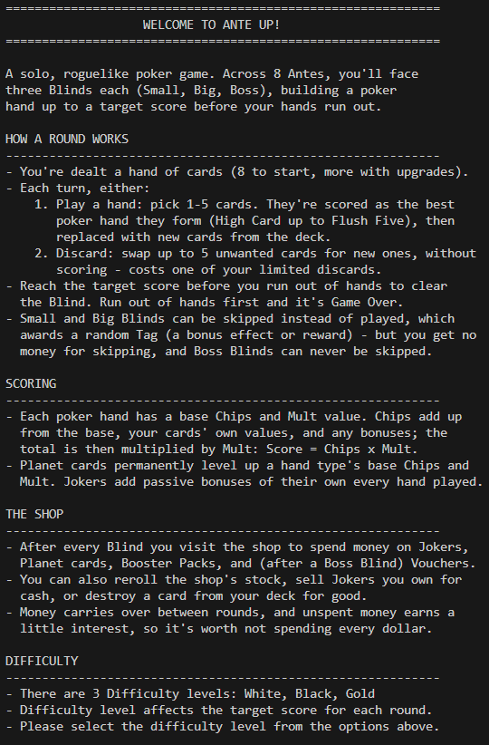
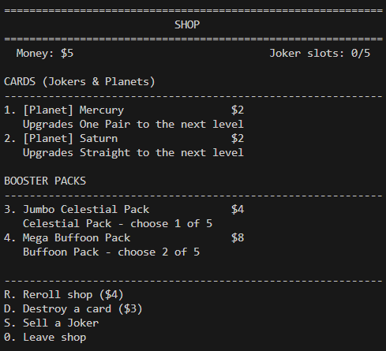

# Ante Up! — A Terminal-Based Roguelike Poker Game

## Overview

**Ante Up!** is a single-player, roguelike deck-builder played entirely in the
terminal. Instead of beating other players, you beat
escalating score targets ("Blinds") by building the best poker hands you can
from a deck you gradually customize between rounds — buying Jokers that add
passive scoring bonuses, Planet cards that permanently level up a poker
hand's base value, and Booster Packs, all funded by an in-run economy you
manage yourself.

There is no external server, database, or GUI — the entire game runs as a
single Python process reading from and writing to the terminal.

## Features

- **Full poker scoring engine** — 12 hand types from High Card up to the
  secret hands Five of a Kind, Flush House, and Flush Five, each with a
  Chips × Mult formula that can be permanently upgraded via Planet cards.
- **An 8-Ante progression** (3 Blinds per Ante: Small, Big, Boss) with an
  optional **Endless mode** once all 8 Antes are cleared, and a lightweight
  Boss-encounter system that varies each Boss Blind's difficulty.
- **A full shop economy** — buy Jokers (26 unique effects) and Planet cards,
  open Buffoon / Celestial / Standard Booster Packs (Regular / Jumbo / Mega
  sizes), buy run-modifying Vouchers, reroll the shop's stock, sell Jokers
  back for cash, and permanently destroy cards from your deck.
- **A 16-Tag reward system** — skipping a Small or Big Blind (instead of
  playing it) grants a random Tag: bonus Jokers, free packs opened on the
  spot, economy boosts, shop discounts, and more.
- **120 automated unit tests** covering every scoring rule, shop mechanic,
  Tag effect, and input validator.

## Technologies / Tools Used

- **Python 3** (standard library only — no third-party runtime dependencies)
- **`unittest`** for automated testing

## Project Structure

| File                    | Responsibility                                                             |
|--------------------------|-----------------------------------------------------------------------------|
| `main.py`                | Game loop / orchestrator: Antes, Blinds, turn flow, wiring everything together |
| `card.py`                | `Card` and `Deck` classes: the 52-card deck, enhancements, dealing/shuffling |
| `poker.py`               | `evaluate_hand()` — classifies a played hand into one of 12 poker hand types |
| `scoring.py`             | `calc_score()` / `target_score()` — Chips × Mult scoring and Blind targets  |
| `shop.py`                | The shop: Jokers, Planet cards, Booster Packs, Vouchers, sell/destroy/reroll |
| `tags.py`                | The 16 Blind-skip Tags and the Boss-encounter variant system                |
| `input_validation.py`    | Re-prompting input validators for every player input in the game            |
| `display.py`             | All terminal output/formatting — no game logic lives here                   |
| `tests.py`               | 120 `unittest` tests covering the modules above                             |

## Installation & Running

Requires **Python 3.8+** and nothing else — no `pip install` needed.

'''bash
git clone <https://github.com/KartikeyaGuptaDS/Poker-roguelike/tree/main>
cd Poker-roguelike
python3 main.py
'''

You'll be shown the rules, asked to pick a difficulty (White / Black /
Gold), and then play turn by turn from the terminal prompts.

## How to Play (quick version)

1. Each Blind, you're dealt a hand of cards. Either:
   - **Play a hand** (1–5 cards) — it's scored as the best poker hand it
     forms, then replaced with new cards; or
   - **Discard** up to 5 cards for new ones (costs a limited discard, no
     score); or
   - **Skip** a Small/Big Blind entirely for a random Tag reward (Boss
     Blinds can never be skipped).
2. Reach the Blind's target score before you run out of hands.
3. After every Blind, visit the shop to spend your money before the next
   one begins.
4. Clear all 8 Antes to win, with the option to keep playing in Endless
   mode.

## Testing

The project ships with a full `unittest` suite:

```bash
python3 -m unittest tests -v
```

This runs **120 tests** across every module — hand evaluation, scoring math
(including Joker and Tag bonuses), shop pricing and purchase logic, the Tag
system, all input validators, and the round-setup helpers in `main.py` — all
passing with **no external test dependencies**.

## Screenshots



Fig 1: Image of Game rules displayed upon startup


Fig 2: Image of result after playing "Two Pair" hand



Fig 3: Image of shop

## AUTHOR
Kartikeya Gupta
26BCE10999
